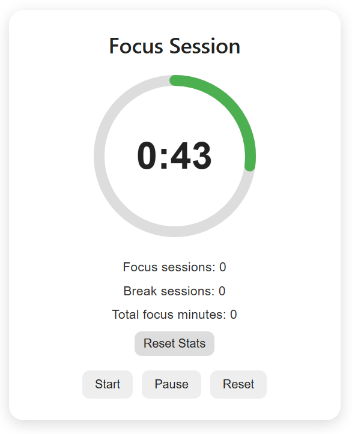
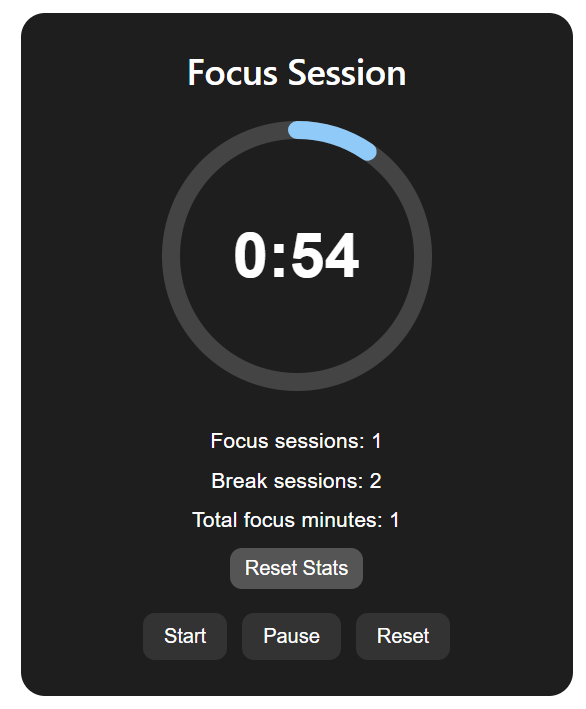

# StudyTimerComponent
Study Timer Web Component is a reusable web component built using React that can be embedded into any web application through a custom HTML tag.

## Installation
#### 1. Clone the repository
Open a terminal and run the following command to download the source code:
``` 
git clone https://github.com/927TriponBriana/StudyTimerComponent.git
```
#### 2. Install dependencies
Download all the required project dependencies using:
``` 
npm install
```
#### 3. Start the development server
To run the local development server use:
``` 
npm run dev
```
After this, open http://localhost:5173/ in any web browser to test the component.
## Usage and attributes
Import the script in the index.html:
``` 
<script type="module" src="path/to/script/study-timer-component.jsx"></script>
```
Then use as a usual HTML element:
```
<study-timer-component duration="number" break-duration="number" theme="string" sound="boolean"></study-timer-component>
```
There are four customizable parameters:
| Attribute | Description | Type | Default |
|------|---------|------|------|
| duration  | Duration of a focus session (minutes) | Number |25|
| break-duration  | Duration of a break session (minutes) | Number |5|
| theme | Component theme (light or dark) | String |light|
| sound |Enables a sound notification when a session finishes|Boolean|false|

## Features
The component currently provides the following functionality:
#### 1. Timer Management & Session Statistics
The component tracks study activity and stores statistics in Local Storage. 
- Start timer
- Pause timer
- End timer
- Automatic switching between focus and break modes
- Completed focus sessions
- Completed break sessions
- Total focus minutes

Statistics can be reset independently from the timer.
#### 2. Theme Support
The component supports two visual themes (light mode and dark mode). This can be configured through component attributes.
#### 3. Circular Progress Indicator & Sound Notifications
The remaining session time is visualized using an animated SVG circular progress indicator.
The progress circle is implemented using two SVG `<circle>` elements:
- A background circle
- A progress circle

The progress circle uses the SVG properties `strokeDasharray` and `strokeDashoffset` to visually represent the completion percentage.
```jsx
const radius = 90;
const stroke = 12;
const normalizedRadius = radius - stroke / 2;
const circumference = normalizedRadius * 2 * Math.PI;

const strokeDashoffset =
    circumference - (progress / 100) * circumference;
```

The SVG rendering logic:
```jsx
<svg height={radius * 2} width={radius * 2}>
    <circle
        stroke={currentStyles.circleBackground.stroke}
        fill="transparent"
        strokeWidth={stroke}
        r={normalizedRadius}
        cx={radius}
        cy={radius}
    />

    <circle
        stroke={currentStyles.circleProgress.stroke}
        fill="transparent"
        strokeWidth={stroke}
        strokeLinecap="round"
        strokeDasharray={circumference}
        strokeDashoffset={strokeDashoffset}
        r={normalizedRadius}
        cx={radius}
        cy={radius}
        style={{
            transition: 'stroke-dashoffset 1s linear',
            transform: 'rotate(-90deg)',
            transformOrigin: '50% 50%',
        }}
    />
</svg>
```

As the timer decreases, the `progress` value is recalculated and the `strokeDashoffset` property updates automatically, creating a smooth animated countdown effect.

When a focus or break session finishes, the component can generate a notification sound using the Web Audio API.

The implementation creates a temporary oscillator and gain node to generate a short beep:

```jsx
const playNotificationSound = useCallback(() => {
    if (!soundEnabled) return;

    const audioContext = new AudioContext();
    const oscillator = audioContext.createOscillator();
    const gainNode = audioContext.createGain();

    oscillator.connect(gainNode);
    gainNode.connect(audioContext.destination);

    oscillator.frequency.value = 880;
    oscillator.type = 'sine';

    gainNode.gain.setValueAtTime(0.2, audioContext.currentTime);
    gainNode.gain.exponentialRampToValueAtTime(
        0.001,
        audioContext.currentTime + 0.5
    );

    oscillator.start();
    oscillator.stop(audioContext.currentTime + 0.5);
}, [soundEnabled]);
```

The sound is triggered automatically when a study or break session reaches zero.

#### 4. Local Storage Persistence
The component automatically saves:
- Current timer mode
- Remaining session time

This allows users to refresh the page without losing progress.
#### 5. Custom Events
The component exposes several custom events that allow external applications to react to timer state changes.

| Event | Description |
|---------|-------------|
| timer-started | Triggered when the timer starts |
| timer-paused | Triggered when the timer pauses |
| timer-reset | Triggered when the timer is reset |
| timer-finished | Triggered when a focus or break session finishes |
| mode-changed | Triggered when switching between focus and break modes |

Example usage:

```javascript
const timer = document.querySelector('study-timer-component');

timer.addEventListener('timer-started', () => {
  console.log('Timer started');
});
```

## Demo
<p align="center">
  
  
</p>
